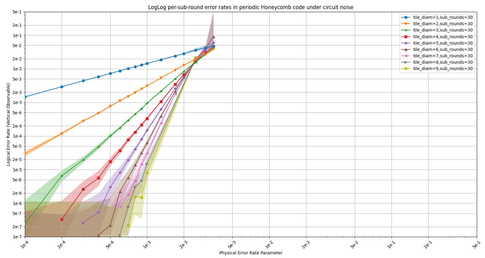

# Honeycomb Threshold Estimation

This repository contains code for estimating the threshold of Hasting and Haah's honeycomb code
from the paper ["Dynamically Generated Logical Qubits"](https://arxiv.org/abs/2107.02194).

The code in this repository uses [Stim](https://github.com/quantumlib/Stim) for defining the code
as a circuit, and for simulating noisy runs of that circuit.
It then decodes those simulated runs using [PyMatching](https://github.com/oscarhiggott/PyMatching/issues)
(or using an internal decoding tool not included in the repository).
Finally, it uses the collected data to produce plots like this one:



# Usage

In a python 3.9+ environment, install the requirements from `requirements.txt`:

```bash
python -m pip install -r requirements.txt
```

The python file `src/main.py` is by default configured to collect a few data points and then plot them.
You can run it in your python environment:

```python src/main.py```

This should create a file `test.csv` and begin populating it (printing CSV data to the file and also to the console).
After a few minutes, it will finish and pop up a plot summarizing the data.

You can get more data by customizing the `collect_simulated_experiment_data` call from `src/main.py`:

```python
collect_simulated_experiment_data(
    *[
        HoneycombLayout(
            noise=p,
            tile_diam=d,
            sub_rounds=30,
        )
        for d in [2, 3, 4]
        for p in np.geomspace(start=5e-4, stop=3e-3, num=5)
    ],
    out_path="test.csv",
    discard_previous_data=True,
    min_shots=10**3,
    max_shots=10**6,
    min_seen_logical_errors=10**2,
)
```

And you can plot data from a csv file using the `plot_data` method from `experiment.py`:

```
plot_data(
    "test.csv",
    title="LogLog per-sub-round error rates in periodic Honeycomb code under circuit noise")
```
